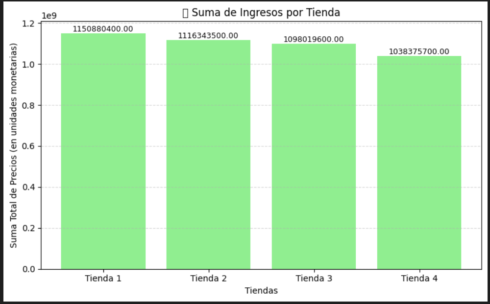
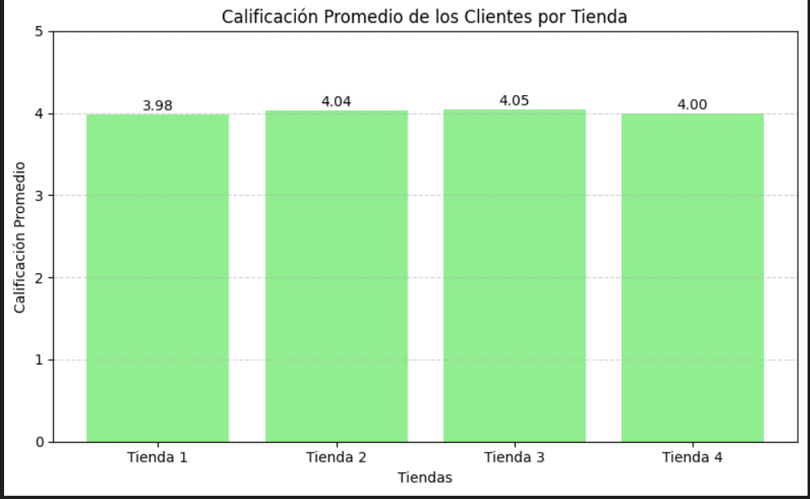
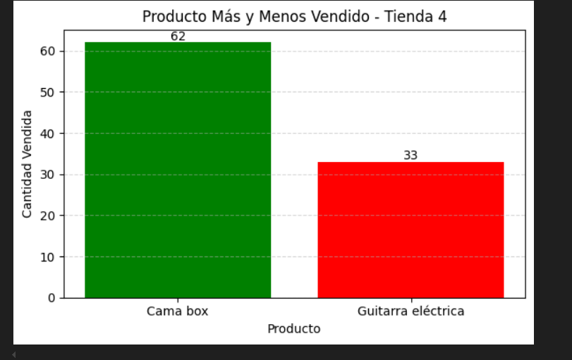
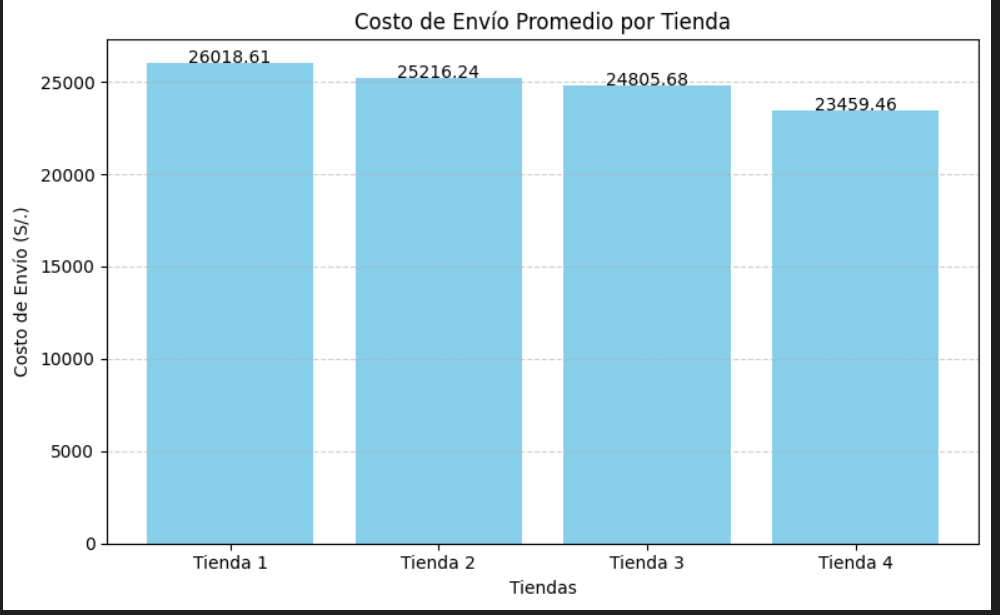
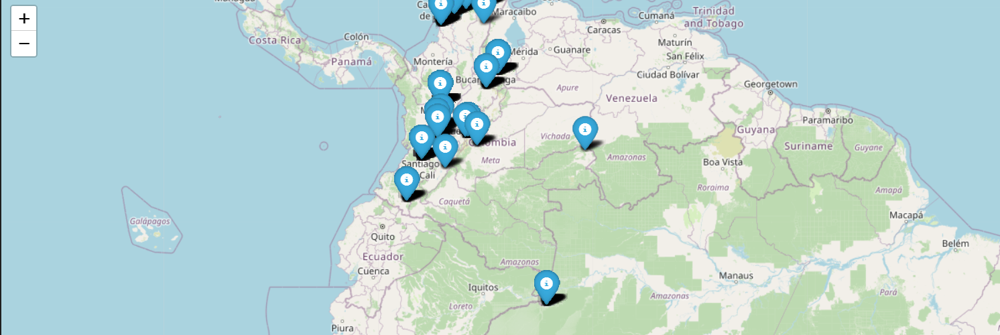

# firstChallangueColab

## El propósito del análisis realizado.

El propsito del analisis realizado es ayudar al Sr. Juan a decidir qué tienda de su cadena debe vender para iniciar un nuevo emprendimiento
lo cual cuenta con 4 tiendas.

## La estructura del proyecto y organización de los archivos.

datos_tienda
AluraStoreLatam.ipynb
images-#.png
README.md

## Ejemplos de gráficos e insights obtenidos.

## Instrucciones para ejecutar el notebook.

Carga de modelos desde github, descarga el archivo en zip o realiza un clone para poder usarlo.
